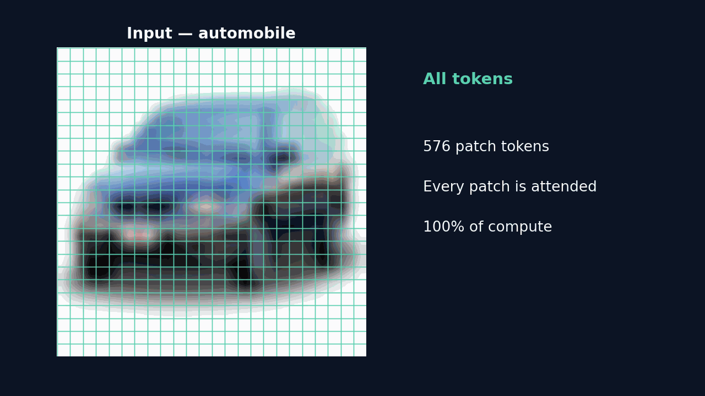

# Dynamic Token Pruning for Vision Transformers (CIFAR-10)

A reproduction of DynamicViT (NeurIPS 2021) using knowledge distillation and asymmetric token pruning on a ViT-Small/384 student.

  



*Progressive token pruning: the student keeps fewer patch tokens at each pruned layer while preserving the class prediction.*

## TL;DR

- Accuracy cost of pruning is **0.08 pt**: pruning OFF reaches **99.00%**, pruning ON reaches **98.92%** on CIFAR-10 test.
- Tokens compound down from **576 → 87** (about **15%** of the original; roughly 85% dropped).
- FLOPs drop **25%** (12.45 → 9.32 GFLOPs at batch 1).
- Throughput is **1.35–1.40×** at batch sizes 32/128, but **0.62× (slower)** at batch size 1.
- Peak VRAM is **higher** for the pruned model, not lower (asymmetric design keeps full-length key/value).

## Key results

Same `vit_small_patch16_384` backbone throughout. Pruning accuracy is the same trained weights with pruning toggled.

### Accuracy (CIFAR-10 test)

| Setting | Top-1 |
|---|---|
| Pruning OFF (keep = 1.0, dense behaviour) | 99.00% |
| Pruning ON (keep 0.75 / 0.50 / 0.40) | 98.92% |
| Accuracy cost of pruning | 0.08 pt |


### Compute and speed (A100 80GB)

| Metric | Dense | Pruned | Speedup |
|---|---|---|---|
| GFLOPs (batch 1) | 12.45 | 9.32 | −25.1% |
| Throughput bs=1 (img/s) | 145.4 | 90.7 | 0.62× |
| Throughput bs=32 (img/s) | 307.8 | 430.7 | 1.40× |
| Throughput bs=128 (img/s) | 328.9 | 445.6 | 1.35× |


The speedup is batch-size dependent: pruning is faster only at server batch sizes (32, 128) and slower at batch size 1, where pruner overhead outweighs the compute saved. See [Limitations](docs/06_limitations.md).

## What token pruning looks like


[▶ explainer video (assets/explainer.mp4)](assets/explainer.mp4)

## Repository structure

```
.
├── src/
│   ├── sota_hybrid_vit.py        # SOTA-Hybrid ViT: AsymmetricTokenPruning + CLS-attention scoring
│   ├── atom_vit.py
│   └── toy_dynamic_vit.py
├── scripts/
│   ├── train_sota_hybrid.py      # KD + cached logits + KDMixup + progressive pruning
│   ├── cache_teacher_logits.py   # precompute teacher logits
│   ├── benchmark_dense_vs_pruned.py
│   ├── visualize_tokens_sota.py
│   ├── plot_results.py
│   ├── make_explainer_video.py
│   └── ... (additional experiment / profiling utilities)
├── docs/
│   └── figures/                  # committed result + visualization figures
├── results/
│   ├── benchmark_results.json
│   ├── benchmark_table.md
│   └── metrics/                  # per-run training metric CSVs
├── assets/
│   ├── hero_pruning.gif
│   └── explainer.mp4
├── slides/
│   ├── FINAL_10_SLIDE_DECK.md
│   └── PRELIMINARY_5_SLIDE_OUTLINE.md
├── report.md
├── requirements.txt
└── LICENSE
```

## Quickstart / reproduce

CIFAR-10 auto-downloads on first run. Trained checkpoints are **not** committed; reproduce them with the commands below.

```bash
pip install -r requirements.txt
# 1. cache teacher logits (one-time)
python scripts/cache_teacher_logits.py
# 2. train the pruned student (KD + ATP), 100 epochs
python scripts/train_sota_hybrid.py --model pruned --model-name vit_small_patch16_384 \
    --img-size 384 --epochs 100 --batch-size 128 --lr 5e-5 \
    --prune-layers 3,6,9 --keep-ratios 0.75,0.5,0.4 \
    --distill-alpha 0.8 --distill-temperature 2.0 \
    --cached-logits outputs/teacher_logits.pt \
    --output-dir outputs/sota_pruned_small_atp_final
# 3. benchmark dense vs pruned
python scripts/benchmark_dense_vs_pruned.py
# 4. figures + video
python scripts/plot_results.py
python scripts/visualize_tokens_sota.py
python scripts/make_explainer_video.py
```

## Documentation

- [01_overview.md](docs/01_overview.md) — project goals and context
- [02_method.md](docs/02_method.md) — ATP-Lite pruning design
- [03_training.md](docs/03_training.md) — KD recipe and curriculum
- [04_results.md](docs/04_results.md) — accuracy and compute results
- [05_visualizations.md](docs/05_visualizations.md) — token maps and figures
- [06_limitations.md](docs/06_limitations.md) — honest trade-offs and caveats
- [07_reproduction.md](docs/07_reproduction.md) — full reproduction steps
- [report.md](report.md) — complete project report
- [slides/FINAL_10_SLIDE_DECK.md](slides/FINAL_10_SLIDE_DECK.md) — final presentation deck

## Limitations

- Speedup is batch-size dependent: about 1.35–1.40× at batch sizes 32/128, but 0.62× (slower) at batch size 1.
- Peak VRAM increases rather than decreases (+71.6% at bs=128); the asymmetric design keeps full-length key/value for a full-context read.
- The pruner modules add +8.1% parameters (21.8M → 23.6M).
- Token importance comes from a single CLS-attention signal, not a trained scorer, so maps are foreground-biased but noisy; CIFAR-10 upscaled to 384px is an easy setting.

See [docs/06_limitations.md](docs/06_limitations.md) for the full discussion.

## Citation

```bibtex
@inproceedings{rao2021dynamicvit,
  title={DynamicViT: Efficient Vision Transformers with Dynamic Token Sparsification},
  author={Rao, Yongming and Zhao, Wenliang and Liu, Benlin and Lu, Jiwen and Zhou, Jie and Hsieh, Cho-Jui},
  booktitle={Advances in Neural Information Processing Systems (NeurIPS)},
  year={2021}
}
```

This is an AIB3004 course reproduction, motivated by the TC-Pruner project (task-conditioned token pruning for a vision-language-action system).

## License

MIT. See [LICENSE](LICENSE).
