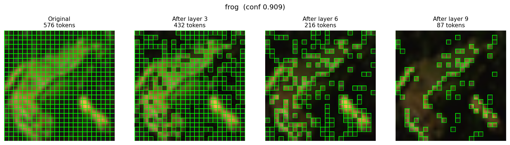
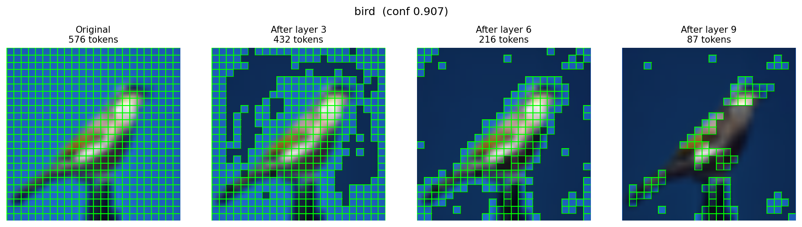

# Token-Pruning Visualizations

This page explains the qualitative figures that accompany ATP-Lite (Asymmetric Token Pruning). They illustrate *which* patch tokens survive each pruning stage and how the kept-token set shrinks across layers. For the quantitative benchmark numbers, see [Results](04_results.md).

## How tokens are scored

Token importance is read from the **CLS-token attention** at blocks 3, 6, and 9. There is no separately trained scorer. A hard top-k drop keeps the highest-scoring patch tokens at each pruned layer, and the keep ratios **compound** across stages. Starting from 576 input patch tokens, the kept set evolves as:

| Stage | Layer | Keep ratio | Tokens kept |
|-------|-------|------------|-------------|
| Input | — | — | 576 |
| After stage 1 | 3 | 0.75 | 432 |
| After stage 2 | 6 | 0.50 | 216 |
| After stage 3 | 9 | 0.40 | 87 |

The final stage retains 87 of 576 tokens (about 15% of the original; roughly 85% dropped).

## Summary grid


The summary grid contrasts the **original image** against the **final kept-token map** (87 of 576 tokens) for several CIFAR-10 classes. It is the fastest way to see, at a glance, where the surviving tokens land relative to the object across classes.

## Progressive pruning

These three figures trace one image at a time through the full pruning schedule, showing the kept-token map at each stage: **576 → 432 → 216 → 87**.






Reading left to right, the kept set tightens around the salient object as later layers discard background and redundant patches.

## How to read these maps (and what not to over-read)

The kept-token maps are **foreground-biased but noisy**. Two caveats matter when interpreting them:

- They are driven by a **single attention signal** (CLS-token attention at three blocks), not a trained importance scorer, so individual kept/dropped decisions can be arbitrary.
- They are computed on **CIFAR-10 images upscaled from 32×32 to 384×384** (bicubic), so fine spatial detail is interpolated, which adds further noise to the maps.

Treat the figures as a coarse, qualitative sanity check that pruning concentrates on the object, not as pixel-accurate saliency. The maps explain *behavior*; they are not evidence of accuracy, speed, or memory characteristics — and pruning is not unconditionally faster or lighter (it is **0.62× slower at batch size 1** and uses **more VRAM**; see [Results](04_results.md) and [Limitations](06_limitations.md)).

## Video and animation

- Explainer video (~56s): [assets/explainer.mp4](../assets/explainer.mp4)
- Hero animation (looping 4-stage pruning): [../assets/hero_pruning.gif](../assets/hero_pruning.gif)

## Regenerate

```bash
# progressive token maps + summary grid
python scripts/visualize_tokens_sota.py

# explainer MP4 + hero GIF
python scripts/make_explainer_video.py
```
