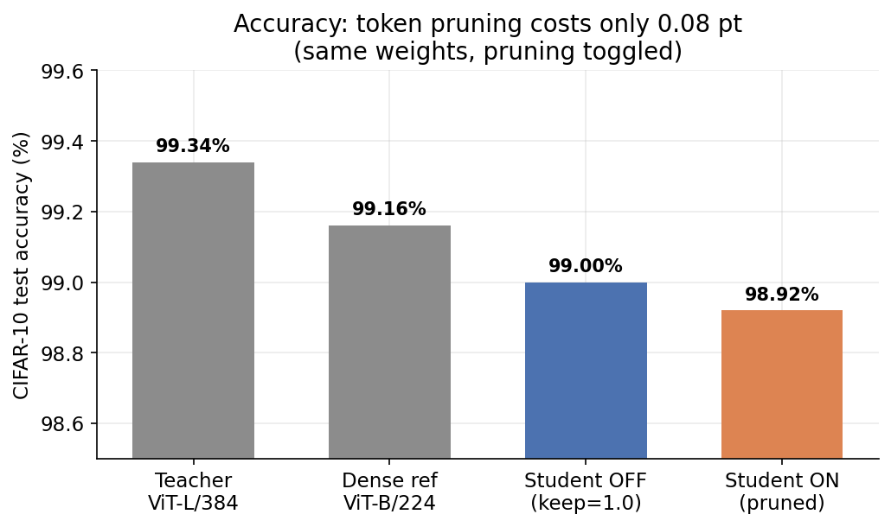
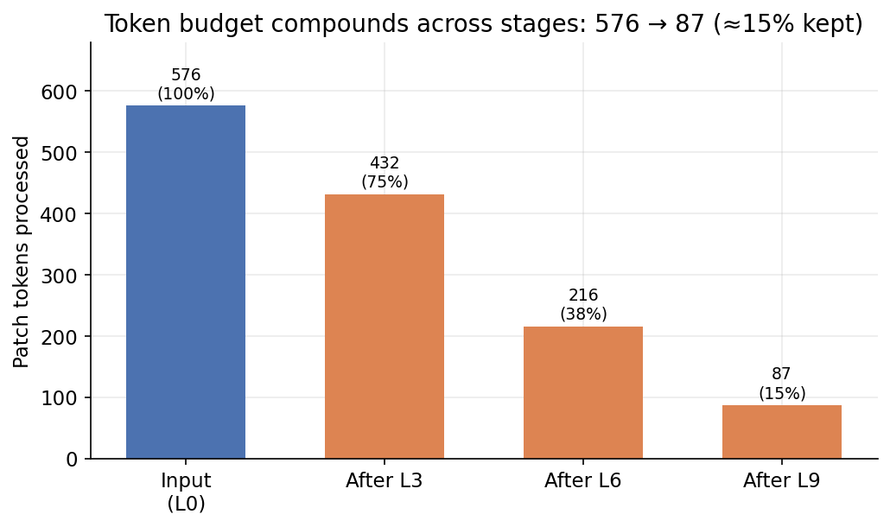
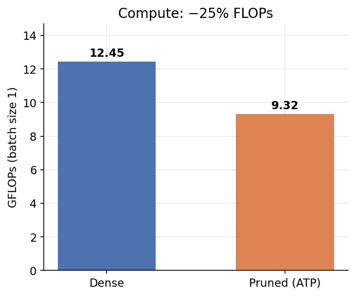
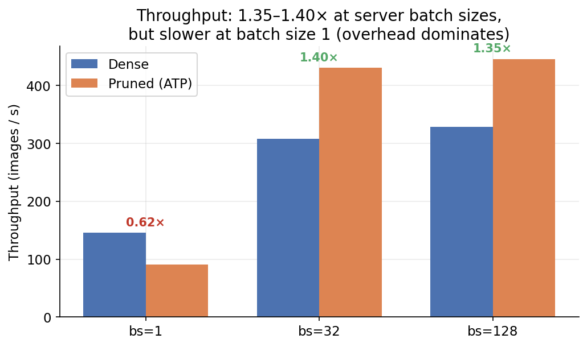
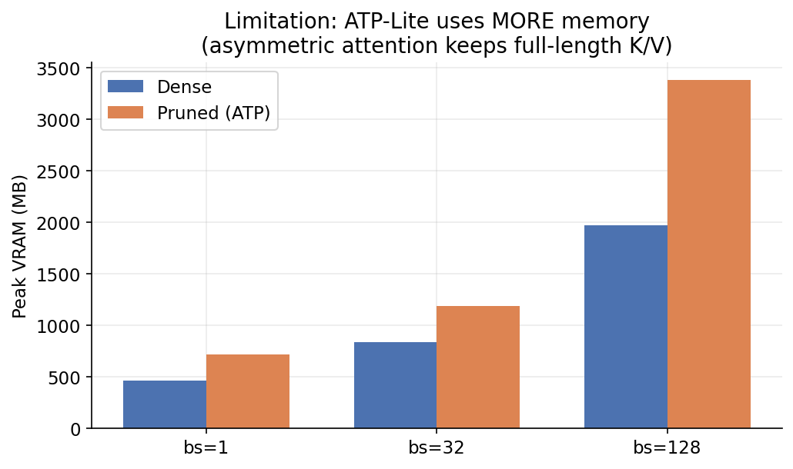
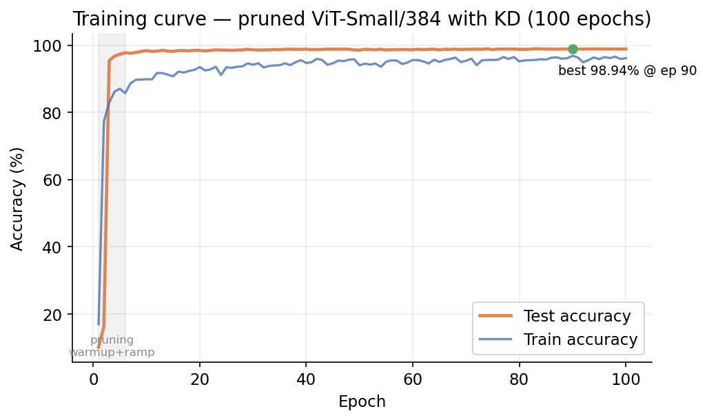
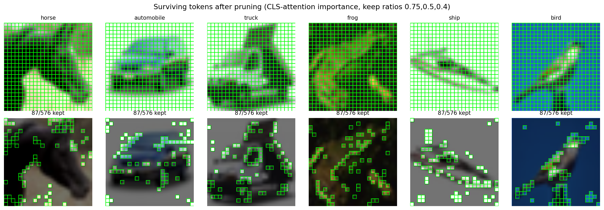
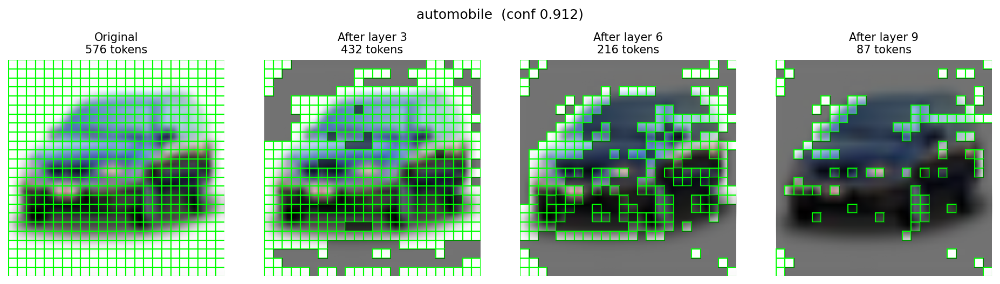

# Reproduction Guide

This guide reproduces the full pipeline end to end: caching teacher logits, training the pruned student with knowledge distillation, benchmarking dense versus pruned, and regenerating every figure and the explainer video. All commands are run from the repository root. For the numbers these steps produce, see [Results](04_results.md); for the honest limitations of the speedup and VRAM behaviour, see [Limitations](06_limitations.md).

## Environment

The project was developed and measured on a single NVIDIA A100 80GB.

| Component | Version / requirement |
| --- | --- |
| Python | 3.x with a CUDA-capable PyTorch build |
| PyTorch | 2.6 |
| CUDA | 12.4 |
| GPU | NVIDIA A100 80GB |
| Key libraries | timm, torchvision, fvcore (FLOP counting), matplotlib, imageio |
| Video | a system `ffmpeg` binary on `PATH` (required by the explainer video) |

Install the Python dependencies:

```bash
pip install -r requirements.txt
```

The explainer-video step additionally requires `ffmpeg` to be installed and available on `PATH`; `pip` does not provide it.

## Repository map

Top-level layout of the repository:

```
.gitignore
LICENSE
PROJECT_PLAN.md
README.md
RUNBOOK.md
report.md
requirements.txt
assets/      # explainer.mp4, hero_pruning.gif
docs/        # documentation, including docs/figures/
outputs/     # training run outputs (checkpoints not committed)
results/     # benchmark_results.json, benchmark_table.md, metrics/
scripts/     # training, caching, benchmarking, figure & video scripts
slides/      # presentation slides
src/         # model definitions
```

Key files referenced by this guide:

| Path | Purpose |
| --- | --- |
| `src/sota_hybrid_vit.py` | SOTA-Hybrid ViT with `AsymmetricTokenPruning` and CLS-attention scoring |
| `scripts/cache_teacher_logits.py` | Precompute teacher logits |
| `scripts/train_sota_hybrid.py` | Train the pruned student (KD + cached logits + KDMixup + progressive pruning curriculum) |
| `scripts/benchmark_dense_vs_pruned.py` | Accuracy / FLOPs / throughput / VRAM benchmark |
| `scripts/plot_results.py` | Result charts |
| `scripts/visualize_tokens_sota.py` | Progressive token and summary-grid figures |
| `scripts/make_explainer_video.py` | Explainer MP4 and hero GIF |
| `results/benchmark_results.json` | Measured benchmark numbers |
| `results/benchmark_table.md` | Measured numbers as a table |

## Reproduction steps

Run the steps in order. CIFAR-10 auto-downloads to `data/` on first use; no manual dataset download is required.

### 1. Cache teacher logits (one-time)

The teacher is run once over the 50,000 clean training images and its outputs are saved as a `[50000, 10]` tensor. Training later blends these cached logits via `KDMixup`, which exploits MixUp's linearity. This offline caching is what cuts KD training from ~35 hours to ~2.5 hours (~14× faster).

```bash
python scripts/cache_teacher_logits.py
```

### 2. Train the pruned student (KD + ATP, 100 epochs)

```bash
python scripts/train_sota_hybrid.py --model pruned --model-name vit_small_patch16_384 \
    --img-size 384 --epochs 100 --batch-size 128 --lr 5e-5 \
    --prune-layers 3,6,9 --keep-ratios 0.75,0.5,0.4 \
    --distill-alpha 0.8 --distill-temperature 2.0 \
    --cached-logits outputs/teacher_logits.pt \
    --output-dir outputs/sota_pruned_small_atp_final
```

### 3. Benchmark dense versus pruned

```bash
python scripts/benchmark_dense_vs_pruned.py
```

### 4. Regenerate figures and the explainer video

```bash
python scripts/plot_results.py
python scripts/visualize_tokens_sota.py
python scripts/make_explainer_video.py
```

## Expected outputs and locations

| Step | Output | Location |
| --- | --- | --- |
| Cache logits | Teacher logits tensor `[50000, 10]` | `outputs/teacher_logits.pt` |
| Train | Training run (checkpoints, metrics) | `outputs/sota_pruned_small_atp_final/` |
| Benchmark | Measured benchmark numbers | `results/benchmark_results.json`, `results/benchmark_table.md` |
| Figures | Result and token-visualization charts | `docs/figures/` |
| Video | Explainer MP4 and hero GIF | `assets/explainer.mp4`, `assets/hero_pruning.gif` |

## Approximate compute time

Times are approximate and measured on a single A100 80GB.

| Stage | Approximate time |
| --- | --- |
| Teacher (50 epochs) | ~30 min |
| Teacher-logit cache | ~2 min |
| Student (100 epochs, KD + ATP) | ~2.5 h |

## Expected results

The trained run reproduces the headline figures. Full discussion is in [Results](04_results.md).



With the same trained weights, accuracy is 99.00% with pruning OFF (keep=1.0) and 98.92% with pruning ON (0.75/0.5/0.4) — an accuracy cost of 0.08 pt.



The keep ratios compound across layers 3 / 6 / 9, taking the sequence from 576 input tokens down to 87 (≈15% of the original; ≈85% dropped).



GFLOPs at batch 1 drop from 12.45 (dense) to 9.32 (pruned), −25.1%.



Throughput is batch-size dependent. The pruned model reaches 1.40× at bs=32 and 1.35× at bs=128, but is 0.62× (slower) at bs=1, where pruner overhead outweighs the compute saved.



Peak VRAM is higher for the pruned model, not lower: at bs=128 it rises from 1972 MB (dense) to 3383 MB (pruned), +71.6%. The asymmetric design keeps full-length key/value for a full-context read, trading memory for accuracy.



The training-time best is 98.94% at epoch 90; the final-epoch (100) value is 98.85%.





## Notes

- **Checkpoints are not committed.** Training writes checkpoints under `outputs/sota_pruned_small_atp_final/`; reproduce them by running step 2.
- **CIFAR-10 auto-downloads to `data/`** on first run. No manual dataset setup is needed.
- The benchmark compares the same `vit_small_patch16_384` backbone throughout: dense speed/FLOPs use a clean dense model (no pruner modules), and pruned uses the trained ATP checkpoint with keep ratios 0.75/0.5/0.4.
- The pruned model adds +8.1% parameters from the pruner modules (dense 21,815,434; pruned 23,586,058).
